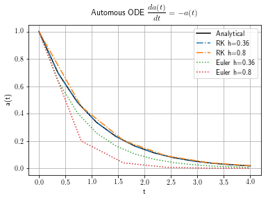
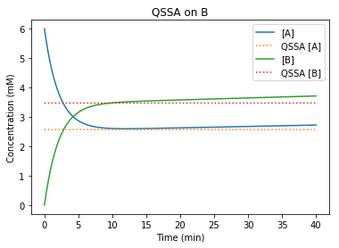
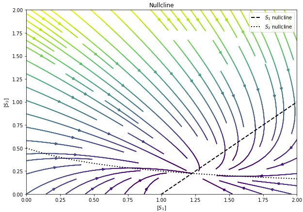
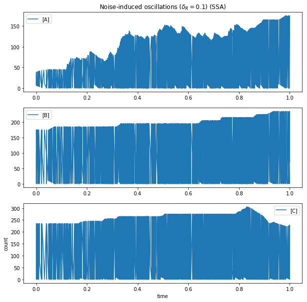
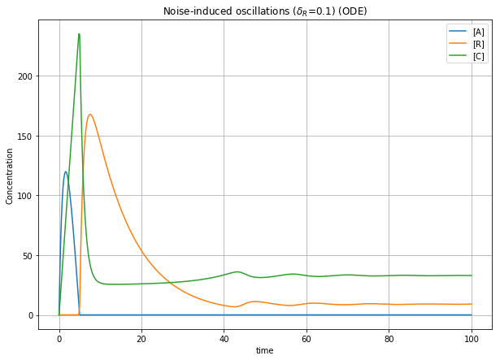
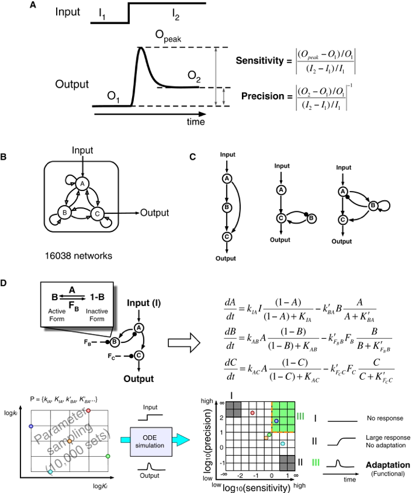

# Modeling and Simulation in Systems Biology

- Instructor: Dr. An-Chi Wei
- TA: Dr. Wen-Wei Tseng (@sosiristseng)
- Syllabous: https://github.com/NTUMitoLab/BEBI-5009

> This repository includes assignments and problems of this course.

## HW1: Network Modleing

- [x] Build biochemical network with **oridinary differential equations** 
- [x] Implement **Fourth-order Runge Kutta Method (RK4)**
- [x] Numerical solution of **automous ODE**

> [Report and source code](HW1_Network-Modeling/HW_2-4-7_Network-Modeling.ipynb)

## HW2: Rapid Equilibrium Approximation

- [x] Model reduction by **Rapid Equilibrium Approximation**
- [x] Model reduction by **Quasi-steady-state Approximation (QSSA)**

> [Report and source code](HW2_Rapid-Eq/HW2_Rapid-Eq.ipynb)

## HW3: Multi-site binding and Hill equation

- [x] Non-Cooperative multi-site binding
- [x] Nullcline analysis

> [Report and source code](HW3_Biochemical-Network/HW3_Biochemical-Network.ipynb)

## HW4: Jacobian and stability analysis
- [x] Jacobian matrix
- [x] Stability analysis
- [x] Eigenvalues

> [Report](HW4_Jacobian/HW4_Jacobian.pdf)

## HW5: Stochastic modeling
- [x] Noise-induced oscillation
- [x] Gillespie algorithm and first reaction method
- [x] Comparison between deterministic and stochastic methods 

|Stochastic oscillation|Deterministic oscillation|
|---|---|
|||

> [Report and source code]()

## Final Presentation:  Defining Network Topologies that Can Achieve Biochemical Adaptation

- [x] Adaptation in nonlinear ODE
- [x] Parameter exploration
- [X] Incoheren feedforward
- [x] Negative feedback

From Ref 2

> [Report and source code](HW6_Final-Paper-presentation/Note-Defining-Network-Topologies-that-Can-Achieve-Biochemical-Adaptation.ipynb)

## Reference
1.  B. P.Ingalls, Mathematical Modelling in Systems Biology : An Introduction, vol. 53, no. 9. 2014.
2. Ma, Wenzhe, et al. "Defining network topologies that can achieve biochemical adaptation." Cell 138.4 (2009): 760-773.